# Technical overview

## Components

```mermaid
flowchart LR
    iosApp["iOS app: review and user intent"] --> backendApi["Tradee backend"]
    backendApi --> policyService["TradingPolicyService"]
    policyService --> tradingService["TradingService and exact fee calculation"]
    tradingService --> dflowApi["DFlow order API"]
    dflowApi --> validator["Transaction and economics validation"]
    validator --> privySigner["Privy user authorization and signing"]
    iosApp --> privySigner
    privySigner --> transactionProvider["Configured transaction provider"]
    transactionProvider --> solanaRpc["Solana mainnet RPC"]
    solanaRpc --> programs["DFlow router and token programs"]
    programs --> tokenAccounts["USDC and xStocks or Sunrise token accounts"]
    solanaRpc --> accounting["Finalized observations and accounting projection"]
    accounting --> backendApi
```

The diagram describes the shipping application's service boundaries. This repository publishes the domain services and selected adapters; the production HTTP host, deployment composition, database contents, and iOS UI remain private.

## Order lifecycle and authorization

1. The app sends an authenticated order request. The backend resolves the wallet and asset, validates policy, and binds an idempotency key to the request.
2. `TradingProvider` isolates DFlow. The DFlow adapter obtains transaction bytes and exact base-unit amounts. Provider discovery cannot expand the trading whitelist.
3. The backend validates the unsigned transaction's digest, required signer, asset accounts, approved fee destination, program allowlist, and quote constraints. The charged-fee integration also verifies swap economics and the composed transaction.
4. The app requests an authorization challenge for the reviewed order. Preparing a challenge is not permission to submit. On explicit confirmation, the app obtains a Privy authorization signature and returns it with the request expiry.
5. The backend rechecks policy and transaction validity, then uses `SponsoredTransactionProvider`. The export contains the Privy-sponsored adapter and the Tradee fee-payer co-sign adapter; the configured route determines which is used.
6. In the co-sign path, Privy signs for the user first. The adapter checks that the returned message is unchanged and the user signature is valid before the distinct fee payer co-signs. Durable signed bytes are journaled before broadcast. Ambiguous results reconcile without manufacturing a fresh transaction.
7. A returned signature is not a confirmed trade. RPC confirmation advances execution; finalized token-balance observations feed accounting. Reconciliation is idempotent and on-chain ownership is authoritative.

The closed-source HTTP host maps the flow to `POST /v1/trading/orders`, `POST /v1/trading/orders/:orderId/authorization`, `POST /v1/trading/orders/:orderId/submit`, and `GET /v1/trading/orders/:orderId`. These are documentation of the application contract, not endpoints started by this snapshot.

## Fees and wallet ownership

- Exact decimal strings and `bigint` token base units carry financial values. Rounding belongs in the fee/quantity modules.
- The legacy `FeeEngine` deducts a platform fee from buy input or sell proceeds, using DFlow input/output fee modes.
- `ChargedTradeQuote` requests a DFlow route with zero provider platform fee, calculates explicit service and network charges, and composes one checked USDC fee transfer into the same reviewed transaction. For buys, swap input plus fees stays within the gross input budget; sells deduct fees from gross proceeds. A route can leave part of the input unspent.
- The network-fee reimbursement in that implementation is distinct from the SOL fee payer. The existence of a sponsor does not establish that every quoted user fee is zero. The app's reviewed quote is authoritative for the user-visible amounts.
- User private keys remain within the wallet provider's signing boundary. The co-sign adapter supports a separately configured **operator fee-payer key**, which is not a user's key. No operator or user key material is published. Synthetic test keypairs are generated at runtime.

## Funding and balances

The external-deposit builder creates a canonical USDC `TransferChecked` and an associated token account instruction when needed. Validation ties the signed transaction to the intended source, recipient, mint, and amount. Allowed wallet-added compute-budget/Lighthouse assertions are checked explicitly.

`SolanaAccountingRpcGateway` reads finalized signatures, transactions, and token accounts, preserving quantities as integer strings. `AccountingEventNormalizer` and `PositionEngine` classify/replay those observations. A Privy funds-deposited webhook is a trigger for independent chain verification, not proof that a deposit exists. Only canonical Solana USDC is recognized as a cash deposit.

## Asset identity

The xStocks adapter normalizes provider metadata and asks Solana for mint information. The Sunrise adapter uses a pinned mint catalog and on-chain Token-2022 scaled-UI metadata. Quantity multipliers and their changes are handled explicitly; display shares are not silently treated as raw token units. This export does not include a PreStocks adapter or claim PreStocks support.

See [programs and instruction inventory](../onchain/README.md) and the [judge guide](judge-guide.md) for evidence paths.
